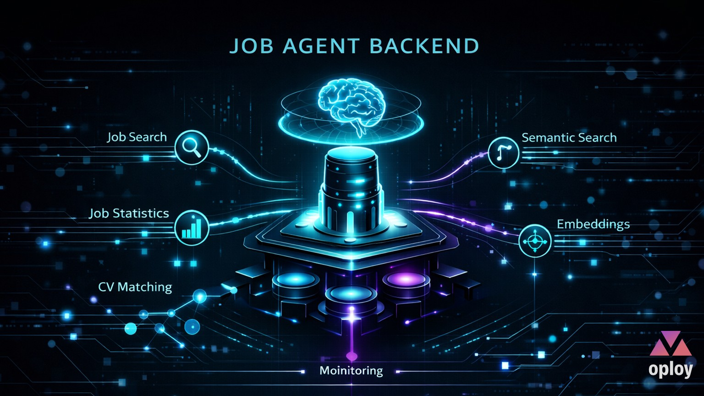
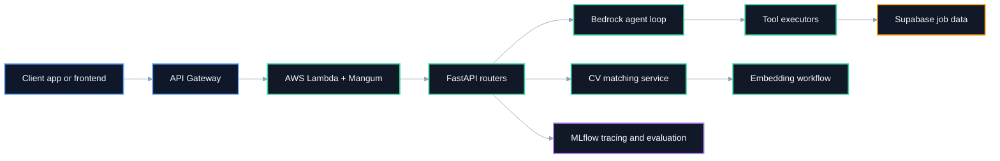
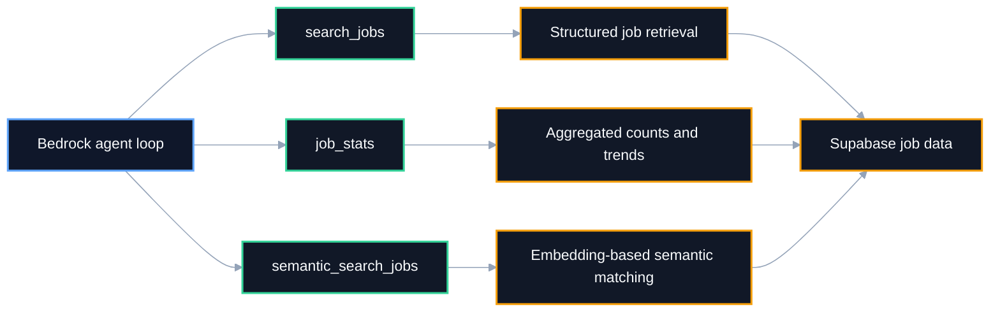
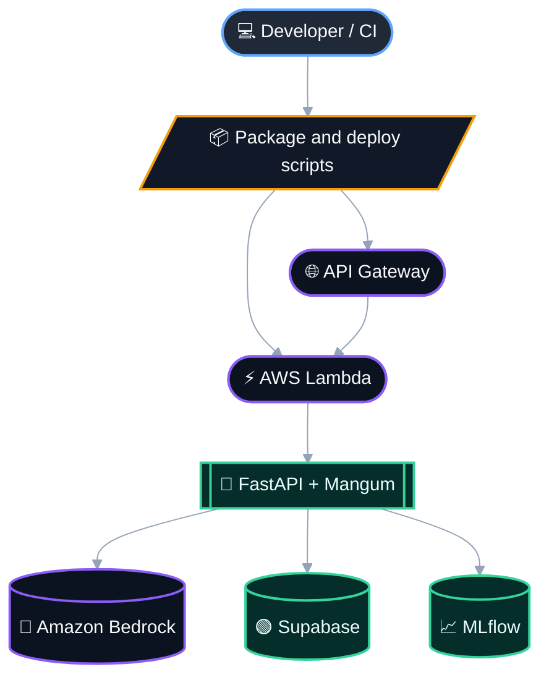
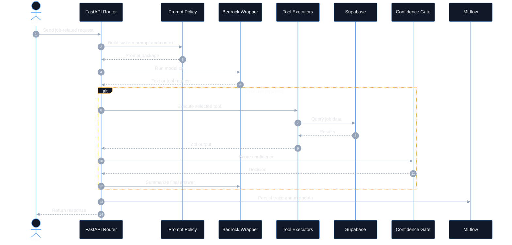

# Job Agent Backend

<p align="center">
  <a href="https://job.oploy.eu/">
    
  </a>
</p>


FastAPI-based AI backend for job search, chat orchestration, CV matching, and MLflow-traced agent evaluation, deployed on AWS Lambda.

> ⭐ If this repository is useful for your work or research, consider starring it to support visibility and future development.

This project powers the backend side of an AI-assisted job experience. It combines a custom Bedrock-driven agent loop, structured job search tools, embedding-based CV matching, and MLflow-backed observability. The implementation is **not** based on LangChain, LangGraph, or Bedrock AgentCore in its current form; it uses a custom orchestration layer around FastAPI and Amazon Bedrock.

## Overview

The backend is responsible for three main product capabilities:

- **AI chat orchestration** for job-related user questions
- **CV matching** using job description embeddings and similarity scoring
- **Direct job search** against Supabase-backed job data

It also includes an evaluation and optimization layer built around MLflow, so prompts, traces, experiments, and agent behavior can be assessed over time.

## Core capabilities

- FastAPI API surface for AI and CV workflows
- AWS Lambda deployment through Mangum
- Amazon Bedrock integration using Claude 3.5 Haiku
- Custom tool-calling agent loop
- Prompt policy and confidence-gating logic
- Supabase-backed structured job retrieval
- Embedding-based CV-to-job matching
- MLflow tracing for chat turns and model/tool activity
- MLflow evaluation and optimization scripts for iterative improvement

## Architecture

The following two diagrams serve different purposes:

- **System architecture overview** shows the major runtime components and request flow.
- **Agent decision flow** explains how the backend combines prompts, Bedrock, tools, and confidence logic.

### 1. System architecture overview

This diagram shows the high-level runtime path from HTTP request to model inference, tools, data access, and observability.


## Runtime design

The codebase is organized around a **custom agent backend** rather than a heavy agent framework.

- FastAPI app bootstrapping lives in [`app.main`](job-agent-backend/app/main.py:1)
- Lambda entrypoint lives in [`lambda_handler.py`](job-agent-backend/lambda_handler.py:1)
- AI routing lives in [`app.routers.ai`](job-agent-backend/app/routers/ai.py:1)
- CV matching lives in [`app.routers.cv_match`](job-agent-backend/app/routers/cv_match.py:1)
- configuration lives in [`app.config`](job-agent-backend/app/config.py:1)

Important implementation note:

- the project currently uses a **custom Bedrock orchestration layer**
- it is **not** implemented as LangChain, LangGraph, or Bedrock AgentCore
- comments in the code suggest the Bedrock wrapper could be swapped later, but that is not the current architecture

## AI and search features

### AI chat agent

The chat backend handles user questions through a tool-capable Bedrock loop. It combines:

- prompt policy construction
- conversation memory
- tool calling for job-data requests
- confidence-gate decisions such as answer, clarification, decline, or handoff

### Tool layer

The current agent exposes **three backend tools** through [`TOOL_DEFINITIONS`](job-agent-backend/app/services/joblab_tools.py:480) and [`TOOL_EXECUTORS`](job-agent-backend/app/services/joblab_tools.py:633):

1. [`search_jobs`](job-agent-backend/app/services/joblab_tools.py:483)  
   Structured job retrieval using filters such as role, country, remote status, job level, platform, tools, and posting dates.

2. [`job_stats`](job-agent-backend/app/services/joblab_tools.py:547)  
   Aggregated statistics for counts, distributions, comparisons, and trend-style questions.

3. [`semantic_search_jobs`](job-agent-backend/app/services/joblab_tools.py:604)  
   Embedding-based semantic retrieval for concept-driven questions where exact keyword matching is not enough.

These three tools are the core bridge between the Bedrock model and the job dataset, and they are a major part of what makes the backend useful and visually interesting as an agent system.

### Tool capabilities overview

This diagram shows the three-tool layer more explicitly so readers can quickly understand what the agent can do beyond plain chat.



### CV matching

The CV module accepts either raw CV text or uploaded PDF content, extracts text, and compares it with job-related embeddings to return relevant matches.

### Direct job search

The backend also supports direct search flows against Supabase-backed job data, allowing structured or semantic retrieval for user-facing job discovery.

## MLflow and optimization

This repository is not only an inference backend; it also contains an experimentation layer.

MLflow is used for:

- production tracing of chat turns
- tool and latency logging
- experiment tracking
- prompt and asset registration
- baseline evaluation
- iterative optimization workflows

At this stage, chat activity is treated as MLflow-traceable experimental data so the agent can be monitored and improved over time.

## Project structure

```text
.
├── app/
│   ├── config.py
│   ├── main.py
│   ├── routers/
│   ├── schemas/
│   └── services/
├── deployment/
│   ├── iam-policy.json
│   ├── lambda-config.json
│   └── trust-policy.json
├── evals/
├── lambda_handler.py
├── requirements.txt
├── requirements-lambda.txt
├── .env.example
├── AGENTS.md
├── LICENSE
└── README.md
```

Companion MLflow deployment and workflow guidance now lives in [`mlflow-tracking-server`](MLflow%20server%20(appropriate%20name)).

## Recommended public repository name

Recommended GitHub repository name: **`job-agent-backend`**

Alternative acceptable names:

- `job-ai-backend`
- `job-search-agent-backend`
- `bedrock-job-agent-backend`

## Setup

### Prerequisites

- Python 3.13
- AWS account with Bedrock access
- Supabase project for job data
- MLflow server optional but recommended for observability and evaluation

### Installation

```powershell
python -m venv .venv
.\.venv\Scripts\Activate.ps1
pip install -r requirements.txt
Copy-Item .env.example .env
```

Then fill your local [`.env`](job-agent-backend/.env) with your own values. Do not commit it.

## Configuration

Main variables are documented in [`.env.example`](job-agent-backend/.env.example).

| Variable | Required | Description |
|---|---:|---|
| `BEDROCK_MODEL_ID` | yes | Bedrock chat model, currently Claude 3.5 Haiku |
| `SUPABASE_URL` | yes | Supabase project URL |
| `SUPABASE_SERVICE_ROLE_KEY` | yes | Server-side key for job data access |
| `CORS_ORIGINS` | yes | Allowed frontend origins |
| `S3_CV_BUCKET` | optional | Bucket for CV storage or related artifacts |
| `MLFLOW_TRACKING_URI` | optional | Primary MLflow tracking server |
| `MLFLOW_EXPERIMENT_NAME` | optional | Production experiment name |
| `MLFLOW_TRACKING_URI_FALLBACK` | optional | Direct database fallback if MLflow server is unavailable |

## API surface

Core backend capabilities include:

- AI ask and feedback flows under the AI router
- CV matching endpoints for text and PDF-based workflows
- health endpoints for service diagnostics

The backend is designed for job-related assistant interactions rather than generic free-form chatbot use.

## Deployment

Deployment is optional and intentionally documented after the main usage overview.

The public deployment shape for this repository is:

- FastAPI application
- wrapped by Mangum
- deployed to AWS Lambda
- exposed through API Gateway
- connected to Bedrock, Supabase, and MLflow-related infrastructure

### AWS deployment overview



## SEO and discoverability

This repository is intentionally documented with search-friendly terms such as:

- FastAPI agent backend
- AWS Lambda AI backend
- Amazon Bedrock Claude 3.5 Haiku
- job search assistant backend
- CV matching with embeddings
- MLflow agent evaluation and tracing

These terms help both search engines and LLM-based discovery systems understand the repository purpose.

## What was cleaned for open-source publication

This public version excludes or replaces:

- committed secrets and real service credentials
- direct database fallback URIs containing passwords
- generated evaluation result files
- local credential-bearing MLflow scripts
- scratch diagrams and internal-only notes

## Appendix: agent request sequence

This diagram provides a more detailed sequence-style view of the backend request lifecycle.



## License

This repository is licensed under the MIT License. See [`LICENSE`](job-agent-backend/LICENSE).
